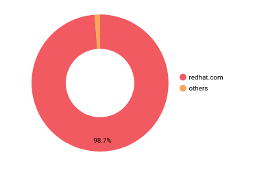
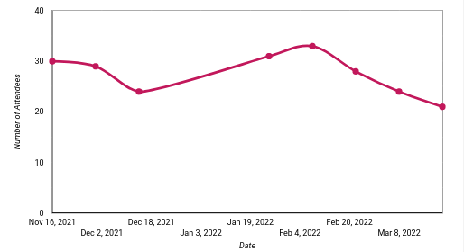
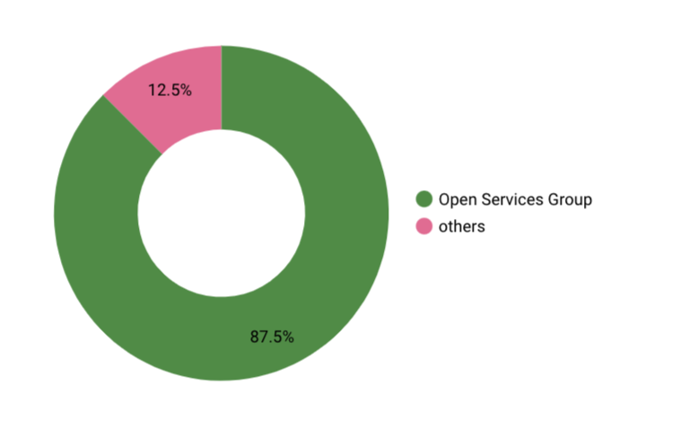
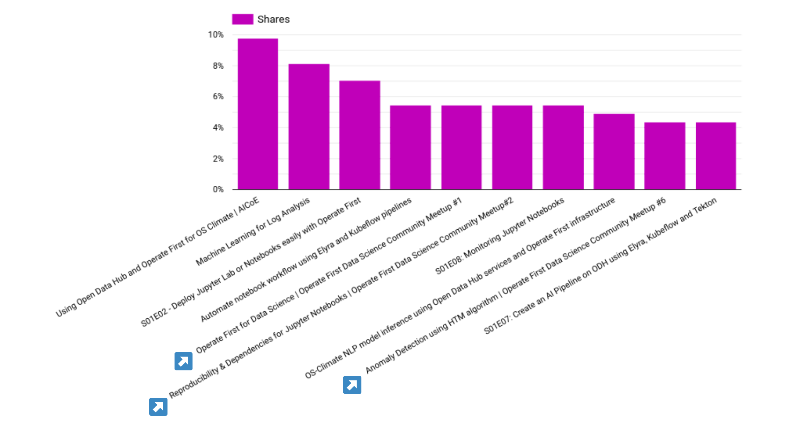
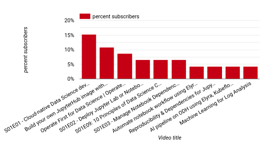
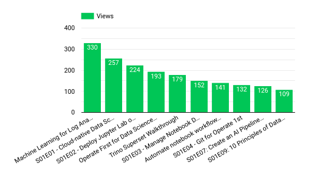
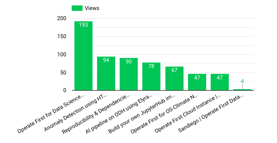

# Operate First Data Science Community Meetup Analytics Report: Q1Y22

The following report outlines some key metrics and associated analysis of the community engagement for the Operate First Data Science Community Meetup between November 16, 2021 and March 31, 2022. If you would like to view recording of past meetups, or see the complete analytics dashboard yourself, please use the following two links: 

* [Detailed dashboard](https://datastudio.google.com/u/1/reporting/de85ebeb-c76a-4930-85bf-b07a1d2becd3/page/qiqpB/edit)
* [Past meetups and recordings](content.md)

### Aim of the community 

The Operate First Data Science Community Meetup is an event open to everyone interested in learning more about how various individuals, teams, and online communities are working towards democratizing the development of production-level AI. 

This meetup aims to embrace the multi-disciplinary nature of the current state of AI operations and cloud infrastructure by covering technical topics relevant to data scientists, software engineers, DevOps professionals, and statisticians alike. And all in an open public forum.

### Number of Meetups hosted 

8

### Total Number of Attendees

155

### Total Number of Unique Attendees

74

### Average number of Attendees per Meetup

28

### Internal vs external attendees

To understand who are the major attendees of the meetup, we try to classify them on the basis of their company email. We see that we have 98.7% of attendees that are internal, i.e. joined the meetup using their Red Hat account, whereas we see 1.3% of attendees who didn't join the meetup using a Red Hat account and are considered external attendees. 

### Number of attendees for each meetup 

There has been an overall consistent attendance across meetups with the average number of attendees being 28 and the lowest number of attendees being 21. We notice a somewhat declining trend in the number of attendees over the past month. Suggestions for addressing this issue are highlighted below under “Goals for Q2”.

### Speakers from various teams

**So far we have had **one external speaker** from the OSPO team present at the meetup.**

## Meetup Engagement on YouTube

To date we have recorded and posted 8 videos of the Operate First Data Science Community Meetup to our YouTube channel. 

### Shares on Meetup Videos posted on Youtube

**3 videos from the 8 operate first DS meetup videos are in the top 10 shared videos across the channel**

### Youtube Channel Subscribers obtained through Meetup videos.

Throughout the lifetime of the channel, 30% of subscribers gained on the channel were through one of the Operate First data science community meetup videos.

### Views 

**4th highest viewed video across the channel and the most viewed video amongst the meetup videos is *Operate First for Data Science | Operate First Community Meetup 1* amounting to 193 views**

Views per video for all the videos:

Views per videos for the meetup videos:

## Expectations for Q2

We aim to expand this community to external contributors and teams and increase participation from external speakers and attendees. We aim to achieve that by:
* Increasing awareness around this meetup and promoting it across multiple channels.
* Effectively promoting past meetups in various forms such as blogs, tweets, etc to build engagement on the content and convert them into meetup attendees and users, and contributors to operate first community.
